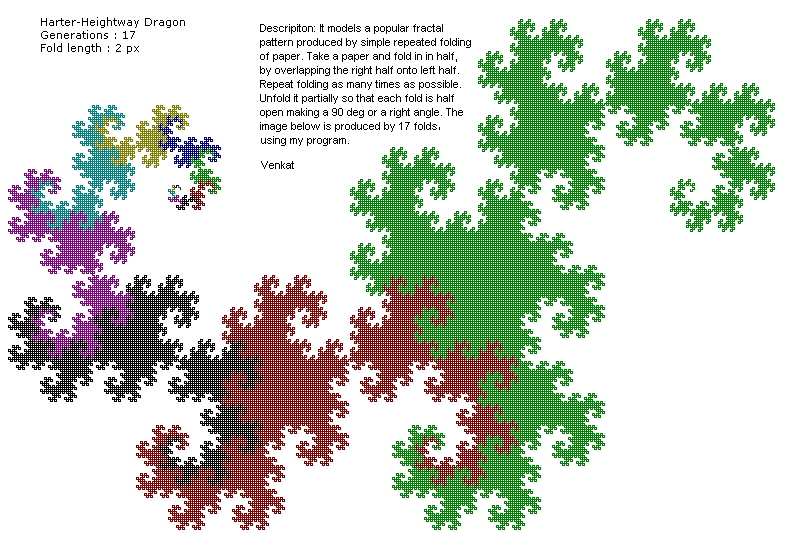

#Harter–Heighway dragon
This is an example of fractal beauty in nature. I can keep looking at it for ever, fascinated by its patterns and properties. Sometime back (in 2000) ported my old C program into Java and generated the following image.

